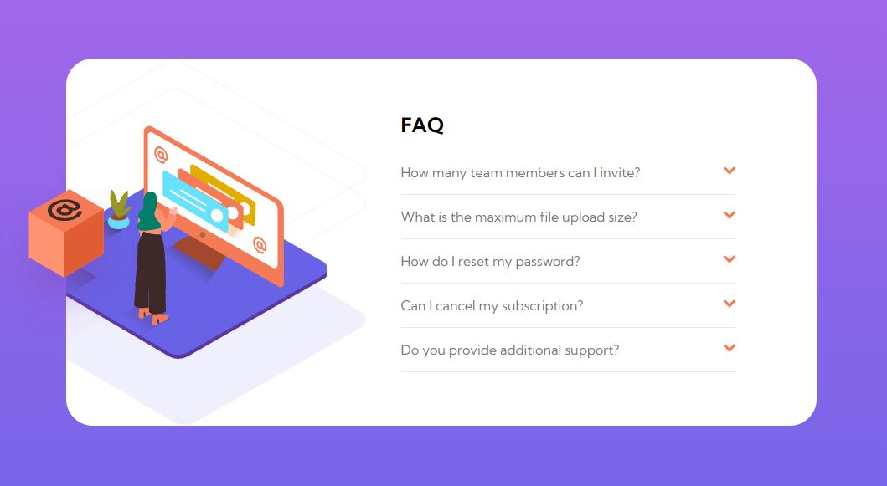

# Frontend Mentor - FAQ accordion card solution

This is a solution to the [FAQ accordion card challenge on Frontend Mentor](https://www.frontendmentor.io/challenges/faq-accordion-card-XlyjD0Oam). Frontend Mentor challenges help you improve your coding skills by building realistic projects. 

## Table of contents

- [Overview](#overview)

  - [The challenge](https://www.frontendmentor.io/challenges/3column-preview-card-component-pH92eAR2-)
  - [Screenshot](https://snipboard.io/DW6s71.jpg)

  
- [My process](#my-process)

  - [Built with](HTML, CSS, JavaScript)
  - [What I learned](JavaScript usage)
  - [Useful resources](https://getbootstrap.com/docs/5.0/components/accordion/)

## Overview

### The challenge

Users should be able to:

- View the optimal layout for the component depending on their device's screen size
- See hover states for all interactive elements on the page
- Hide/Show the answer to a question when the question is clicked

### Screenshot

### Links

- Solution URL: [My Solution](https://your-solution-url.com)
- Live Site URL: [Faq Accordion Page](https://monks-faq-accordion.netlify.app/)

## My process

### Built with

- Semantic HTML5 markup
- CSS custom properties
- Flexbox
- Mobile-first workflow
- Vanilla JavaScript

## Author

- Frontend Mentor - [@Crazimonk](https://www.frontendmentor.io/profile/Crazimonk)
- Twitter - [@crazi_monk](https://www.twitter.com/https://twitter.com/crazi_monk)
